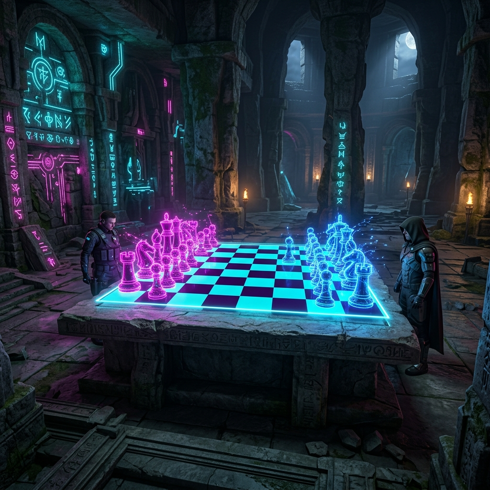
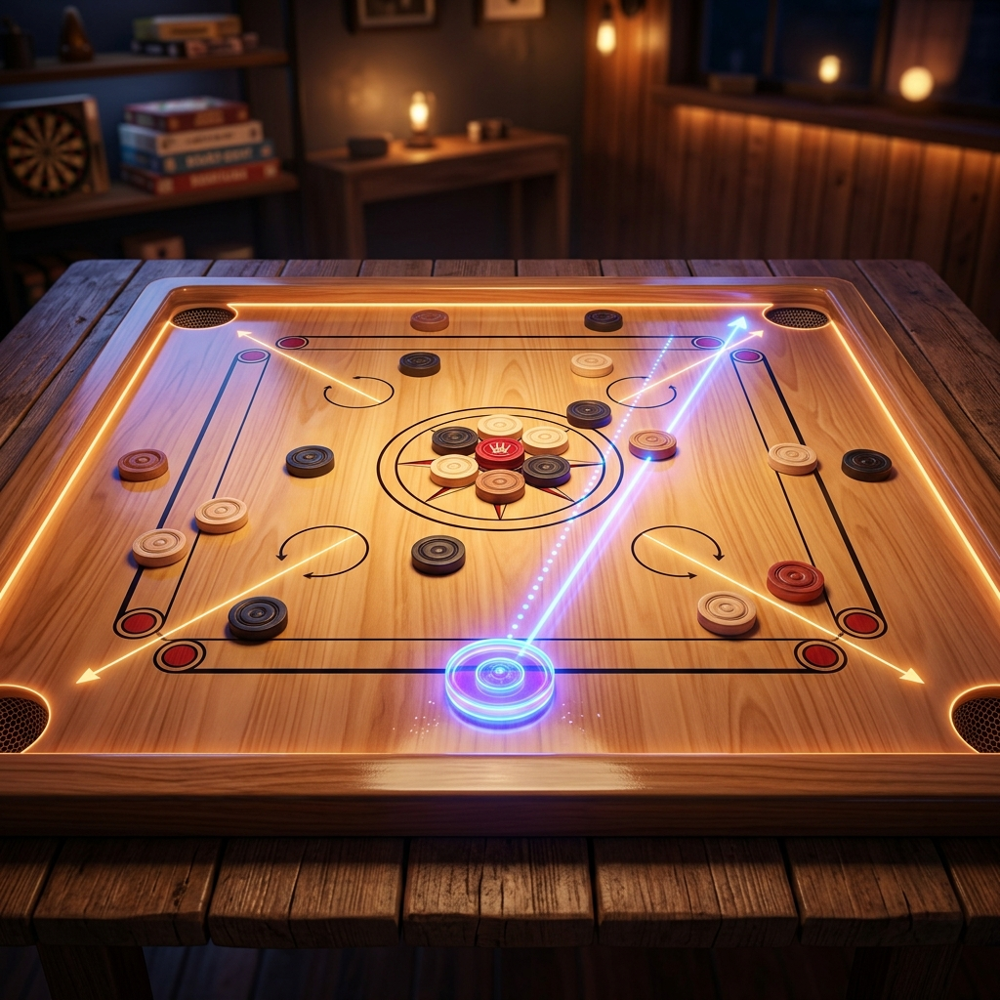
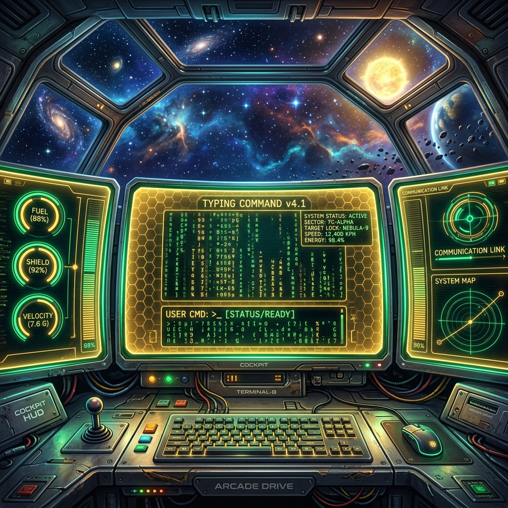

# 🎮 ARCADEVERSE — Next-Gen Retro Web Arcade

Welcome to **ArcadeVerse**, a next-generation retro arcade platform packed with immersive multiplayer games, dynamic visual themes, micro-animations, and real-time multiplayer lobbies. 

This entire project is a testament to the power of **Vibe Coding** with AI, built hand-in-hand with **Antigravity AI (Google DeepMind)**.

---

## ⚡ Built via Vibe Coding
> [!IMPORTANT]
> **This codebase was created entirely via Vibe Coding.** 
> By utilizing natural language guidance and instant iteration with **Antigravity AI**, we built custom UI frameworks, real-time socket messaging, custom physics engines, and polished, responsive retro designs in record time without writing boilerplates by hand.

---

## 🎮 The Games

ArcadeVerse hosts three flagship custom-built retro games, each featuring custom visual styles and offline/online capabilities.

| Game | Banner Preview | Description & Features |
| :--- | :--- | :--- |
| **Chess Legends** |  | **A Cyber-Retro Board Matrix Match.** Features dynamic board themes (Stone, Neon), real-time check warnings, customizable bot AI difficulties (Easy, Medium, Hard), and moves telemetry tracking. |
| **Carrom Ocean Masters** |  | **Realistic Physical Strike Simulation.** Built with custom coordinate flick slider controls, visual strike force indicators, striker skin customization (Classic, Tron, Royal, Ruby), and real-time score registries. |
| **Typing Warriors** |  | **Cyberpunk Arena Word Combat.** Face off against typing speed bots or real opponents. Features real-time words-per-minute (WPM) calculations, progress meters, and dynamic difficulty pacing. |

---

## 🛠️ The Tech Stack

### 💻 Frontend (Client)
* **Framework**: Next.js 15+ (React)
* **Language**: TypeScript
* **Styling**: Tailwind CSS for custom futuristic styling, glassmorphism, and cybernetic layouts
* **Animations**: Framer Motion for smooth transitions, slide-ins, and popups
* **Audio**: Custom Synth Synthesizer generating authentic arcade-style sound effects directly via Web Audio API

### 🔌 Backend (Server)
* **Runtime**: Node.js & TypeScript
* **Server Framework**: Express
* **Real-time Engine**: Socket.io for persistent room-based bi-directional communications
* **Database fallback**: File-based persistent JSON Database (`db.json`) for zero-friction storage out-of-the-box
* **Security**: JWT Authentication & BCrypt hashing

---

## 🌐 Platforms & Deployment

ArcadeVerse is deployed across multiple high-performance cloud providers to ensure maximum accessibility and unlimited gameplay:

* **Vercel**: Hosts the optimized Next.js static production bundle.
* **Netlify**: Hosts a continuous deployment copy linked directly to the main GitHub repository.
* **Render**: Runs the persistent WebSocket and API server, enabling room creation and cross-client multiplayer sync.

---

## 🚀 One-Click Deploy (Render Blueprint)

You can launch your own full-stack copy of the backend and frontend on Render with a single click:

[](https://render.com/deploy?repo=https://github.com/AbhayPotle/ARCADE-GAMES)

---

## ⚙️ Running Locally

### Prerequisites
* **Node.js** (v18 or higher)
* **npm** or **yarn**

### 1. Clone the repository
```bash
git clone https://github.com/AbhayPotle/ARCADE-GAMES.git
cd ARCADE-GAMES
```

### 2. Start the Backend Server
```bash
cd server
npm install
npm run dev
```
*Runs on `http://localhost:5000`*

### 3. Start the Frontend client
```bash
cd ../client
npm install
npm run dev
```
*Runs on `http://localhost:3000`*